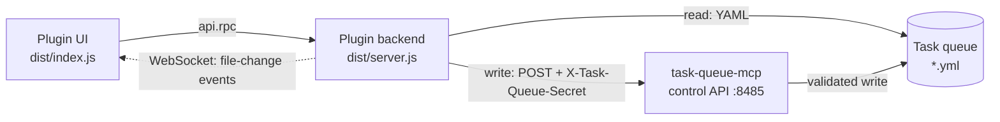

# cloudcli-plugin-task-queue

[](https://claude.ai/code)
[](https://opensource.org/licenses/MIT)

A CloudCLI tab plugin that gives [task-queue-mcp](https://github.com/TadMSTR/task-queue-mcp) a browser UI. View, filter, and act on agent tasks — approve, park, amend, cancel, and launch a session — without leaving the editor.

**This plugin is a front end. It does nothing on its own**: `task-queue-mcp` owns the queue, and every mutation this plugin makes is proxied to that server's control API.

## Requirements

- **[task-queue-mcp](https://github.com/TadMSTR/task-queue-mcp)** — the queue backend. This plugin is a UI for it and does nothing without it.
- **CloudCLI** ([claudecodeui](https://github.com/siteboon/claudecodeui)) with permission-gated plugin env passthrough — see [How the plugin receives its env vars](#how-the-plugin-receives-its-env-vars).
- **Node.js 20+**

## Architecture

Four moving parts. The asymmetry is the important bit: **reads go direct to the queue files, writes always go through the MCP server.**



Reading directly keeps the list fast and lets the backend watch the directory for live updates. Routing every write through `task-queue-mcp` means mutations inherit its transition validation, `fcntl` locking, and atomic writes, so the plugin can never leave a task in a state the queue's own rules forbid. **The plugin never writes queue YAML directly.**

- **UI** (`dist/index.js`) — renders the tab panel: a filterable task list and a detail view with history timeline, amendments, and context-ref previews.
- **Backend** (`dist/server.js`) — HTTP + WebSocket server launched by CloudCLI. Picks a free ephemeral port at startup and reports it to CloudCLI as JSON on stdout. The UI reaches it through CloudCLI's plugin RPC API (`api.rpc()`).

Live updates arrive over WebSocket: the backend watches the queue directory and pushes a `tasks` event when files change; the UI debounces refreshes by 2s.

## Features

- Task list with filters by agent, status, and task type, grouped by target agent
- Detail view: full task data, history timeline, amendments, and context-ref file previews (confined to the queue and comms directories)
- Session launch — **review mode** (plan permission; the agent presents a summary and waits) or **auto mode** (the agent claims the task and executes)
- Lifecycle actions, all proxied through the shared-secret control API as actor `operator`:
  - **Approve** a submitted or pending task
  - **Cancel** a non-terminal task — a graceful terminal record, never deleted, instead of mislabelling it `failed`
  - **Park / Unpark** — pause a task without losing sight of it. A parked task stays in the list, renders muted with an `Unpark` button, is exempt from TTL expiry, and won't be picked up until you unpark it. Unparking returns it to the status it was parked from.
  - **Amend** — append a correction to a queued task. The original description is never rewritten; amendments render below it, highlighted, so a reader can't act on stale instructions by mistake.
  - **Status change** — advance a task an agent missed (audited operator override)
  - **Requeue** — return a dead-lettered task to the queue at `submitted` (see below)
- Live connection indicator and a manual refresh button

## Dead letters

A collapsed section below the task list, showing every record in
`~/.claude/task-queue/dead-letters/` — tasks `task-dispatcher` gave up routing after
exhausting its retries. Nothing picks one up and no agent can transition it.

It exists because nothing could show them. `get_task` searched the queue root then
`archive/` and answered `not found`; this plugin globbed the queue root only. Seventeen
tasks accumulated in that directory between 2026-05-29 and 2026-07-25 — every one a
security audit request, all seventeen carrying the identical `failed_reason` — and the
only notice any of them ever got was a single Matrix message at the moment it was dropped.
A known bug quietly ate seventeen security audits over three months (vikunja#557).

Three decisions worth stating:

- **Collapsed, and a section rather than a tab.** The healthy count here is zero, so a tab
  would be permanently empty furniture. What it must never be is absent — the heading
  renders whatever the count is, including `none`, and turns red the moment it is not.
- **Grouped by failure reason.** Seventeen records with one identical reason are one bug
  that fired seventeen times. Rendering them as seventeen sibling rows reproduces exactly
  the reading that let them sit. Largest group first; newest failure first within a group.
- **The count loads on every refresh, not on expand.** A count that only appears once the
  operator opens the section is a count nobody sees.

**Requeue** sends a record back to the queue at `submitted` with its `failed_reason`
cleared and its retry count reset, via `POST /tasks/:id/requeue` on the control API — an
operator-only route in `task-queue-mcp` v0.10.0+. It is confirmed before firing, and the
confirmation says the thing that matters: requeueing does **not** fix why the task was
dropped. All seventeen of the records this shipped against would dead-letter again for the
same reason, which is vikunja#63/#169 and a separate piece of work.

## Headless runs

Below the task list, a read-only section lists agent sessions launched with no operator
watching — steward in particular runs as `agent-steward` under `claude -p`, emits one block
of final text, and exits. Every such launch already wrote its full stdout to
`~/.claude/comms/artifacts/task-launches/<agent>-<task8>.log`; before this section existed,
26 of these had accumulated with nothing able to show them, and one completed steward run
stayed invisible for four days.

Each row shows agent, short task id, status, started, duration, outcome, and the first line
of output. Click a row to open the full log.

**Status comes from the task queue, not from the log.** A log proves a session ran; it does
not prove the task closed. The two disagreeing — a finished run whose task is still
`approved` — is the feature working, not a bug. This holds for the run record too: a record
saying the run exited 0 never promotes a task's status.

### Run records

Both launchers now write `<agent>-<task8>.json` beside the log. It is a **sibling**, never a
replacement — the `.log` name is what this plugin's own reader parses and what the
launch-log retention job matches on.

The list is the **union** of the two artefacts, keyed on the shared `<agent>-<task8>` stem:

- A **log with no record** is one of the 29 runs that predate them. Times still come from
  the file's mtime, and the outcome column reads `no run record`.
- A **record with no readable log** is the security-audit launcher, which writes its output
  to `~/.pm2/logs/security-audit-<build>.log`. That prefix stays outside the preview
  allowlist deliberately — it covers every PM2 service log on this host, and adding it would
  make this endpoint a reader of all of them. The row renders anyway and the detail view
  says where the log is, because dropping it would omit the commonest kind of headless
  session here.

**The outcome column has three honest states and does not collapse them.**

| Rendered | Means |
|---|---|
| `no run record` | Predates run records; nothing is known about how it ended |
| `running` | A record with no `ended` |
| `exit 0`, `exit 137` | A real observed exit code — only this plugin's own launches get one |
| `ended, exit code unknown` | The run ended and the code is unrecoverable |
| `slot released — still running` | Past the dispatcher's max runtime; its concurrency slot was freed and the process was left alone |

`ended, exit code unknown` is not a gap. A dispatcher tick spawns a detached child and
exits, so the child is reparented and its status is reaped by init — there is no `waitpid()`
and no surviving `/proc` entry. This plugin is a long-lived process and *can* observe its own
children exit, so runs it starts carry a real code. Rendering the unknown case as success
would be a counter reporting success for something nobody observed succeed.

**Duration can be unknown**, rendered as an em dash. With a record it is `ended - started`,
and it is unknown while the run is still open — deliberately not "now minus started", which
would tick upward forever for a session that died an hour ago and has not been reaped.
Without a record it comes from the log file's timestamps, where birthtime is only trusted
when it precedes mtime: every log migrated into the shared directory on 2026-08-27 was
copied rather than moved, and a copy resets birthtime while preserving mtime.

Open runs sort above finished ones. A plain descending compare on `ended` puts them at the
bottom, under three months of finished runs.

Below the log text, a **Commands** block lists every fenced code block scraped from the
output, each with a copy button. The extraction is deliberately dumb — no inference about
which lines are "really" commands, no language-tag filtering — except that an **unterminated
fence is dropped**: a fence with no closing delimiter has no known end, and these strings are
meant to be pasted into a shell.

Both routes (`GET /headless-runs`, `GET /headless-runs/:id`) are read-only, resolve through
the same realpath path guard as the rest of the plugin, and need no new manifest permission
or env var — see [Backend API](#backend-api).

## Non-goals

- **Not a queue schema owner.** Statuses, transitions, and validation belong to `task-queue-mcp`. This plugin renders what that server permits and surfaces its rejections verbatim.
- **Not an agent runner.** It can spawn a session for a task; it does not supervise, monitor, or manage agents after launch.
- **Not a dead-letter fixer.** The Dead letters section shows what was dropped and offers
  to put it back. It does not and cannot repair the reason it was dropped — that lives in
  the dispatcher and in whatever wrote the task.
- **Not a general task tracker.** It is scoped to one queue directory of agent-coordination tasks — not a replacement for an issue tracker.

## Installation

```bash
npm install
./deploy.sh
```

`deploy.sh` builds the TypeScript, copies the plugin into CloudCLI's plugins directory (`~/.claude-code-ui/plugins/cloudcli-plugin-task-queue/`), and prints the restart command. CloudCLI manages the backend process lifecycle.

```bash
# Required after deploying — the plugin server is reloaded with the host process.
pm2 restart cloudcli
```

## Environment variables

| Variable | Default | Purpose |
|----------|---------|---------|
| `TASK_QUEUE_API` | `http://127.0.0.1:8485` | Base URL of the task-queue-mcp HTTP control API. Configurable — the default assumes the MCP server runs loopback-local to CloudCLI. |
| `TASK_QUEUE_API_SECRET` | — | Shared secret sent as `X-Task-Queue-Secret` on every mutation. **Required** — mutations fail closed if unset. Comes from your secret store, never from source. |
| `CLOUDCLI_ORIGIN` | — | Additional allowed WebSocket origin, and the origin the CloudCLI host's plugin proxy sends on its upstream leg. Both sides read the same variable so they cannot disagree. `http://localhost:3001` and `http://127.0.0.1:3001` are always allowed. |
| `AGENT_LAUNCH_POLICY` | `~/scripts/agent-launch.yml` | Path to the launch policy file (see [Session launch behaviour](#session-launch-behaviour)). |

### How the plugin receives its env vars

CloudCLI launches the backend as a subprocess and **strips host environment variables from it by default**, including secrets. A host var reaches the plugin only when **both** are true:

1. `manifest.json` declares it — `permissions: ["env:TASK_QUEUE_API", "env:TASK_QUEUE_API_SECRET", "env:CLOUDCLI_ORIGIN"]`, and
2. the var is on CloudCLI's host-side plugin env allowlist.

This needs a CloudCLI build with permission-gated env passthrough. **Without it the launcher silently strips the secret and every mutation fails closed** — the UI reports an error, but nothing about the failure names the passthrough as the cause. If mutations fail while reads work, check this first. The control-API call path logs missing-secret and unreachable-transport failures to the CloudCLI process's stderr log, and never logs the secret value.

Adding a new env var means updating *both* the manifest `permissions` and the host allowlist, or it is silently refused.

## Backend API

The backend exposes a small HTTP API consumed by the UI via `api.rpc()`.

| Method | Path | Description |
|--------|------|-------------|
| `GET` | `/health` | Liveness check; returns `{status, uptime, version}` |
| `GET` | `/tasks` | List tasks; query params `agent`, `status`, `type` |
| `GET` | `/tasks/:id` | Task detail plus context-ref previews |
| `POST` | `/tasks/:id/start` | Launch a session; body `{mode: "review"\|"auto"}`. Spawns locally, writes a run record, and records the launch in the task's history |
| `POST` | `/tasks/:id/approve` | Approve — proxied |
| `POST` | `/tasks/:id/cancel` | Cancel (terminal); body `{note?}` — proxied |
| `POST` | `/tasks/:id/status` | Operator status change; body `{status, note?, allow_override?}` — proxied |
| `POST` | `/tasks/:id/park` | Park; body `{note?}` — proxied |
| `POST` | `/tasks/:id/unpark` | Unpark; body `{note?, status?}` — proxied |
| `POST` | `/tasks/:id/amend` | Append an amendment; body `{amendment, reason?}` — proxied |
| `POST` | `/tasks/:id/requeue` | Requeue a dead-lettered task; body `{note?}` — proxied |
| `GET` | `/dead-letters` | List dead-lettered tasks. Read-only |
| `GET` | `/headless-runs` | List headless agent runs; query param `agent`. Read-only |
| `GET` | `/headless-runs/:id` | One run's full log text plus scraped commands; `:id` is `<agent>-<task8>`. Read-only |

Reads are served directly from the queue YAML. Every proxied mutation carries the `X-Task-Queue-Secret` header and an `actor` of `operator`.

WebSocket upgrade is handled on the same port. Clients receive `{type: "connected", version}` on connect and `{type: "tasks", count, changed}` when task files change.

The upgrade handler gates on the **peer address** first: the server binds `127.0.0.1` on an ephemeral port, so a non-loopback peer is refused outright. An `Origin` is then checked against the allowlist **only if one is present**. A loopback peer that sends no `Origin` is accepted, because that is what CloudCLI's own plugin WS proxy looks like — the `ws` client library sends no `Origin` unless one is passed, and that leg is already authenticated by CloudCLI before the proxy is invoked. A present-but-wrong `Origin` is still refused.

> Do not "harden" this by rejecting a missing `Origin`. v0.4.0 did exactly that and 403'd every connect for three weeks, because the only client that reaches this port is the trusted proxy. The loopback bind is the boundary. The rule is a pure function in `src/ws-guard.ts` with tests for all three cases.

## Session launch behaviour

| Mode | Permission mode | Agent prompt |
|------|----------------|--------------|
| `review` | `plan` | Read the task, present a summary, wait for approval |
| `auto` | `default` | Read the task, claim it (`in-progress`), execute |

`mode` is validated against that set at the parse site. An **omitted** mode defaults to
`review` — the safe leg. A **present but unrecognised** mode is a 400, not a silent
default: defaulting would downgrade an operator who asked for `auto`, turning a typo into
a session that quietly does nothing.

### The launch policy file

A task's `target_agent` is resolved through a **data file**, not a map in the source:
`~/scripts/agent-launch.yml` by default, overridable with `AGENT_LAUNCH_POLICY`. Adapting
this plugin to a different set of agents means editing that file — no rebuild.

```yaml
my-agent:
  project_dir: ~/.claude/projects/my-agent

# An agent that must NOT run as the plugin's own user:
my-isolated-agent:
  project_dir: ~/.claude/projects/my-isolated-agent
  run_as_user: agent-my-isolated-agent
  launcher: /usr/local/sbin/forge/run-my-isolated-agent.sh
```

The file is deliberately shared with whatever else launches your agents (on the reference
deployment, a cron dispatcher reads the same file). A second copy of this roster is what
this release removes: the plugin's private map had drifted and was missing an agent
entirely, so Start refused it.

#### Two validators, one corpus

`~/scripts/agent-launch.yml` is validated independently by this plugin and by the cron
dispatcher, in two languages, with no shared code. They have already disagreed: one
resolved symlinks on the project root and the other did not, so an entry accepted here was
rejected there — and on the reference deployment that did not merely reject an entry, it
made the dispatcher fail to import on every tick.

`npm run gate:corpus` closes that. task-dispatcher owns
`tests/fixtures/launch-policy-corpus.json`, a set of accept/reject cases; this plugin
fetches it from that repo's `main` and asserts its own validator agrees on every one.

It compares **resolved values**, not just verdicts, and that is not belt-and-braces. Its
first run found a second live divergence: Node's `path.normalize` keeps a trailing
separator where Python's `os.path.normpath` strips it, so a `project_dir` written with a
trailing slash was accepted by both sides and resolved to two different strings — one of
which becomes a spawned session's working directory. No verdict ever disagreed.

#### Pre-launch credential guards

A Start of a directly-launched agent is refused, by name, if `SCOPED_MCP_BEARER_TOKEN` is
unresolved or no usable Anthropic credential is available. Without this, such a session
spawns and then fails deep inside — a 401 from every scoped-mcp tool, or a `claude -p`
that short-circuits to "Not logged in" before it reads the prompt. From the operator's
side both look like an agent that started and did nothing.

The plugin also layers `/opt/appdata/agents/<agent>/.env` into the child environment,
which the dispatcher has always done and this plugin did not. That is the substance of the
fix rather than a side effect: on the reference deployment the plugin's own process
carries no `SCOPED_MCP_BEARER_TOKEN`, so directly-launched sessions were genuinely
starting without one.

**Neither guard runs for a `run_as_user` agent, and that asymmetry is deliberate.** Such
an agent's credentials are not in this process's environment by design — they are in a
file only the target user can read, sourced by the launcher as that user, which performs
the equivalent checks itself. Running these checks on that path would fail every launch
for the one agent whose isolation is working correctly.

**`run_as_user` is the part that matters.** An entry carrying it is launched as
`sudo -n -u <user> <launcher> --workflow-mode <mode> -- <prompt>` — never as `claude`
directly. That indirection exists because such an agent's credentials are readable only by
that user; spawning `claude` as the plugin's own user instead would produce a session that
appears as the agent in every log while holding none of its credentials. If the launcher is
missing or not executable, Start fails **by name**; it does not fall back.

Every field is validated against a closed set — agent name shape, `project_dir` under
`~/.claude/projects`, `run_as_user` matching `agent-*`, `launcher` under
`/usr/local/sbin/forge/` — and the whole document is rejected on any violation. A missing or
malformed file disables Start with a named error rather than yielding an empty policy, since
an empty policy makes `run_as_user` absent for *every* agent.

A task whose `target_agent` is absent from the file returns a clean `Unknown agent` error
rather than launching.

> **Mode vocabulary.** Start sends `review | auto`; a launcher taking `--workflow-mode`
> receives `semi-auto | auto | manual-then-auto`, mapped explicitly. `auto` passes through.
> `review` becomes `semi-auto`, **except** for a task queued as `manual-then-auto`, which is
> passed through unchanged: both gate this leg, but only `manual-then-auto` lets the tasks
> that session spawns run unattended, and flattening it re-pins the whole chain to
> `semi-auto`. For a run-as agent, `review` is **prompt-enforced only** — the reference
> launcher sets `--dangerously-skip-permissions` itself and accepts no permission mode, so
> `--permission-mode plan` is not reachable. The UI says so on launch rather than implying a
> tool gate.

### Launch logs and run records

Each launch appends to `~/.claude/comms/artifacts/task-launches/<agent>-<task8>.log`, the
same shape and directory the reference dispatcher writes, so both are listable together, and
writes `<agent>-<task8>.json` beside it. The session also receives `FORGE_RUN_ID` and
`FORGE_TASK_ID` in its environment, which is what makes a trace joinable back to its task.

### A Start leaves a mark on the task

Before v0.9.0 a Start made **no queue mutation at all**, so a plugin-started task stayed at
`approved` until its agent got as far as claiming it — and a session that died before that
left nothing behind anywhere. That is why one completed steward run was invisible for four
days.

A Start now appends a history entry through the control API. **The status is deliberately
unchanged**: the call re-asserts the status the task is already in. Advancing
`approved` → `in-progress` here is the obvious-looking alternative and it breaks every
plugin-started session — the agent's own first action is `update_task(in-progress)`, which
task-queue-mcp permits only *from* `approved`. Doing it for the agent means its claim is
rejected as an invalid transition.

A failure to record is logged and does not fail the Start: the session is already running by
then, and reporting the launch as failed would be the bigger lie.

## Development

```bash
npm install
npm run build   # tsc --noEmit (typecheck) + esbuild bundle to dist/
npm test        # node --test — requires Node 22.18+
npm run gate:vocabulary   # asserts the queue vocabulary matches task-queue-mcp's main
npm run gate:corpus       # asserts the launch-policy validator agrees with
                          # task-dispatcher's, over a corpus that repo owns
```

Both gates reach the network and fail if they cannot — deliberately; a parity check that
skips offline has verified nothing. They are **separate** npm scripts and separate CI
steps because they read different upstreams: a red from one means "edit
`src/vocabulary.ts`" and a red from the other means "edit `src/launch-policy.ts`". Folding
them together would let either hide the other, and would make "which upstream moved" a log
dive.

`npm run build` is the typecheck gate — `tsc --noEmit` runs first and the bundle only happens if it passes.

The test runner executes the `.ts` files directly using Node's built-in type stripping, so **`npm test` needs Node 22.18+** even though the plugin itself runs on Node 20+ (`dist/` is bundled plain JS).

## License

MIT — see [LICENSE](LICENSE).
