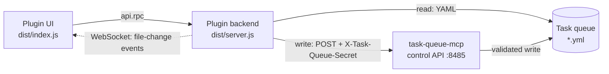

# cloudcli-plugin-task-queue

[](https://claude.ai/code)
[](https://opensource.org/licenses/MIT)

A CloudCLI tab plugin that gives [task-queue-mcp](https://github.com/TadMSTR/task-queue-mcp) a browser UI. View, filter, and act on agent tasks — approve, park, amend, cancel, and launch a session — without leaving the editor.

**This plugin is a front end. It does nothing on its own**: `task-queue-mcp` owns the queue, and every mutation this plugin makes is proxied to that server's control API.

## Requirements

- **[task-queue-mcp](https://github.com/TadMSTR/task-queue-mcp)** — the queue backend. This plugin is a UI for it and does nothing without it.
- **CloudCLI** ([claudecodeui](https://github.com/siteboon/claudecodeui)) with permission-gated plugin env passthrough — see [How the plugin receives its env vars](#how-the-plugin-receives-its-env-vars).
- **Node.js 20+**

## Architecture

Four moving parts. The asymmetry is the important bit: **reads go direct to the queue files, writes always go through the MCP server.**



Reading directly keeps the list fast and lets the backend watch the directory for live updates. Routing every write through `task-queue-mcp` means mutations inherit its transition validation, `fcntl` locking, and atomic writes, so the plugin can never leave a task in a state the queue's own rules forbid. **The plugin never writes queue YAML directly.**

- **UI** (`dist/index.js`) — renders the tab panel: a filterable task list and a detail view with history timeline, amendments, and context-ref previews.
- **Backend** (`dist/server.js`) — HTTP + WebSocket server launched by CloudCLI. Picks a free ephemeral port at startup and reports it to CloudCLI as JSON on stdout. The UI reaches it through CloudCLI's plugin RPC API (`api.rpc()`).

Live updates arrive over WebSocket: the backend watches the queue directory and pushes a `tasks` event when files change; the UI debounces refreshes by 2s.

## Features

- Task list with filters by agent, status, and task type, grouped by target agent
- Detail view: full task data, history timeline, amendments, and context-ref file previews (confined to the queue and comms directories)
- Session launch — **review mode** (plan permission; the agent presents a summary and waits) or **auto mode** (the agent claims the task and executes)
- Lifecycle actions, all proxied through the shared-secret control API as actor `operator`:
  - **Approve** a submitted or pending task
  - **Cancel** a non-terminal task — a graceful terminal record, never deleted, instead of mislabelling it `failed`
  - **Park / Unpark** — pause a task without losing sight of it. A parked task stays in the list, renders muted with an `Unpark` button, is exempt from TTL expiry, and won't be picked up until you unpark it. Unparking returns it to the status it was parked from.
  - **Amend** — append a correction to a queued task. The original description is never rewritten; amendments render below it, highlighted, so a reader can't act on stale instructions by mistake.
  - **Status change** — advance a task an agent missed (audited operator override)
- Live connection indicator and a manual refresh button

## Non-goals

- **Not a queue schema owner.** Statuses, transitions, and validation belong to `task-queue-mcp`. This plugin renders what that server permits and surfaces its rejections verbatim.
- **Not an agent runner.** It can spawn a session for a task; it does not supervise, monitor, or manage agents after launch.
- **Not a general task tracker.** It is scoped to one queue directory of agent-coordination tasks — not a replacement for an issue tracker.

## Installation

```bash
npm install
./deploy.sh
```

`deploy.sh` builds the TypeScript, copies the plugin into CloudCLI's plugins directory (`~/.claude-code-ui/plugins/cloudcli-plugin-task-queue/`), and prints the restart command. CloudCLI manages the backend process lifecycle.

```bash
# Required after deploying — the plugin server is reloaded with the host process.
pm2 restart cloudcli
```

## Environment variables

| Variable | Default | Purpose |
|----------|---------|---------|
| `TASK_QUEUE_API` | `http://127.0.0.1:8485` | Base URL of the task-queue-mcp HTTP control API. Configurable — the default assumes the MCP server runs loopback-local to CloudCLI. |
| `TASK_QUEUE_API_SECRET` | — | Shared secret sent as `X-Task-Queue-Secret` on every mutation. **Required** — mutations fail closed if unset. Comes from your secret store, never from source. |
| `CLOUDCLI_ORIGIN` | — | Additional allowed WebSocket origin, and the origin the CloudCLI host's plugin proxy sends on its upstream leg. Both sides read the same variable so they cannot disagree. `http://localhost:3001` and `http://127.0.0.1:3001` are always allowed. |
| `AGENT_LAUNCH_POLICY` | `~/scripts/agent-launch.yml` | Path to the launch policy file (see [Session launch behaviour](#session-launch-behaviour)). |

### How the plugin receives its env vars

CloudCLI launches the backend as a subprocess and **strips host environment variables from it by default**, including secrets. A host var reaches the plugin only when **both** are true:

1. `manifest.json` declares it — `permissions: ["env:TASK_QUEUE_API", "env:TASK_QUEUE_API_SECRET", "env:CLOUDCLI_ORIGIN"]`, and
2. the var is on CloudCLI's host-side plugin env allowlist.

This needs a CloudCLI build with permission-gated env passthrough. **Without it the launcher silently strips the secret and every mutation fails closed** — the UI reports an error, but nothing about the failure names the passthrough as the cause. If mutations fail while reads work, check this first. The control-API call path logs missing-secret and unreachable-transport failures to the CloudCLI process's stderr log, and never logs the secret value.

Adding a new env var means updating *both* the manifest `permissions` and the host allowlist, or it is silently refused.

## Backend API

The backend exposes a small HTTP API consumed by the UI via `api.rpc()`.

| Method | Path | Description |
|--------|------|-------------|
| `GET` | `/health` | Liveness check; returns `{status, uptime, version}` |
| `GET` | `/tasks` | List tasks; query params `agent`, `status`, `type` |
| `GET` | `/tasks/:id` | Task detail plus context-ref previews |
| `POST` | `/tasks/:id/start` | Launch a session; body `{mode: "review"\|"auto"}` (a local spawn, not a queue mutation) |
| `POST` | `/tasks/:id/approve` | Approve — proxied |
| `POST` | `/tasks/:id/cancel` | Cancel (terminal); body `{note?}` — proxied |
| `POST` | `/tasks/:id/status` | Operator status change; body `{status, note?, allow_override?}` — proxied |
| `POST` | `/tasks/:id/park` | Park; body `{note?}` — proxied |
| `POST` | `/tasks/:id/unpark` | Unpark; body `{note?, status?}` — proxied |
| `POST` | `/tasks/:id/amend` | Append an amendment; body `{amendment, reason?}` — proxied |
| `GET` | `/headless-runs` | List headless agent runs; query param `agent`. Read-only |
| `GET` | `/headless-runs/:id` | One run's full log text plus scraped commands; `:id` is `<agent>-<task8>`. Read-only |

Reads are served directly from the queue YAML. Every proxied mutation carries the `X-Task-Queue-Secret` header and an `actor` of `operator`.

WebSocket upgrade is handled on the same port. Clients receive `{type: "connected", version}` on connect and `{type: "tasks", count, changed}` when task files change.

The upgrade handler gates on the **peer address** first: the server binds `127.0.0.1` on an ephemeral port, so a non-loopback peer is refused outright. An `Origin` is then checked against the allowlist **only if one is present**. A loopback peer that sends no `Origin` is accepted, because that is what CloudCLI's own plugin WS proxy looks like — the `ws` client library sends no `Origin` unless one is passed, and that leg is already authenticated by CloudCLI before the proxy is invoked. A present-but-wrong `Origin` is still refused.

> Do not "harden" this by rejecting a missing `Origin`. v0.4.0 did exactly that and 403'd every connect for three weeks, because the only client that reaches this port is the trusted proxy. The loopback bind is the boundary. The rule is a pure function in `src/ws-guard.ts` with tests for all three cases.

## Session launch behaviour

| Mode | Permission mode | Agent prompt |
|------|----------------|--------------|
| `review` | `plan` | Read the task, present a summary, wait for approval |
| `auto` | `default` | Read the task, claim it (`in-progress`), execute |

### The launch policy file

A task's `target_agent` is resolved through a **data file**, not a map in the source:
`~/scripts/agent-launch.yml` by default, overridable with `AGENT_LAUNCH_POLICY`. Adapting
this plugin to a different set of agents means editing that file — no rebuild.

```yaml
my-agent:
  project_dir: ~/.claude/projects/my-agent

# An agent that must NOT run as the plugin's own user:
my-isolated-agent:
  project_dir: ~/.claude/projects/my-isolated-agent
  run_as_user: agent-my-isolated-agent
  launcher: /usr/local/sbin/forge/run-my-isolated-agent.sh
```

The file is deliberately shared with whatever else launches your agents (on the reference
deployment, a cron dispatcher reads the same file). A second copy of this roster is what
this release removes: the plugin's private map had drifted and was missing an agent
entirely, so Start refused it.

**`run_as_user` is the part that matters.** An entry carrying it is launched as
`sudo -n -u <user> <launcher> --workflow-mode <mode> -- <prompt>` — never as `claude`
directly. That indirection exists because such an agent's credentials are readable only by
that user; spawning `claude` as the plugin's own user instead would produce a session that
appears as the agent in every log while holding none of its credentials. If the launcher is
missing or not executable, Start fails **by name**; it does not fall back.

Every field is validated against a closed set — agent name shape, `project_dir` under
`~/.claude/projects`, `run_as_user` matching `agent-*`, `launcher` under
`/usr/local/sbin/forge/` — and the whole document is rejected on any violation. A missing or
malformed file disables Start with a named error rather than yielding an empty policy, since
an empty policy makes `run_as_user` absent for *every* agent.

A task whose `target_agent` is absent from the file returns a clean `Unknown agent` error
rather than launching.

> **Mode vocabulary.** Start sends `review | auto`; a launcher taking `--workflow-mode`
> receives `semi-auto | auto`, mapped explicitly. For a run-as agent, `review` is
> **prompt-enforced only** — the reference launcher sets `--dangerously-skip-permissions`
> itself and accepts no permission mode, so `--permission-mode plan` is not reachable. The
> UI says so on launch rather than implying a tool gate.

### Launch logs

Each launch appends to `~/.claude/comms/artifacts/task-launches/<agent>-<task8>.log`, the
same shape and directory the reference dispatcher writes, so both are listable together.

## Development

```bash
npm install
npm run build   # tsc --noEmit (typecheck) + esbuild bundle to dist/
npm test        # node --test — requires Node 22.18+
```

`npm run build` is the typecheck gate — `tsc --noEmit` runs first and the bundle only happens if it passes.

The test runner executes the `.ts` files directly using Node's built-in type stripping, so **`npm test` needs Node 22.18+** even though the plugin itself runs on Node 20+ (`dist/` is bundled plain JS).

## License

MIT — see [LICENSE](LICENSE).
